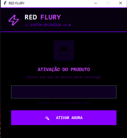
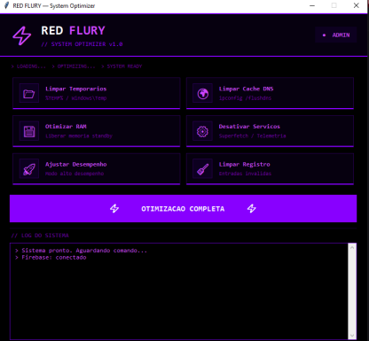
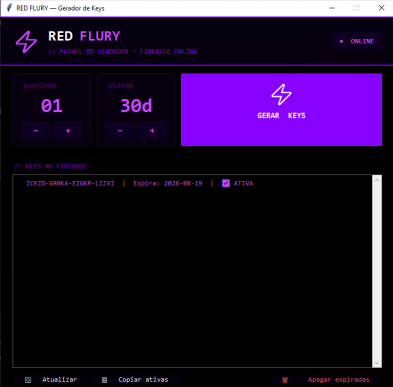

# RED FLURY — System Optimizer

Aplicativo desktop em Python para otimização de performance do Windows, com interface gráfica feita em Tkinter e sistema de ativação por chave de licença.

## Funcionalidades

- Limpeza de arquivos temporários
- Limpeza de cache DNS
- Otimização de memória RAM
- Desativação de serviços do Windows (Superfetch, Telemetria, etc.)
- Ajuste de desempenho (modo de alto desempenho)
- Limpeza de registro (remoção de entradas inválidas)
- Sistema de ativação por chave de licença (validação online)

## Tecnologias utilizadas

- **Python**
- **Tkinter** (interface gráfica)

## Screenshots

**Tela de ativação:**



**Menu principal:**



**Painel de geração de chaves (uso interno, não incluso neste repositório):**



## Como usar

O aplicativo é distribuído como script Python (`.py`) — não há instalador ou executável.

### Pré-requisitos

- Python 3.x instalado ([download aqui](https://www.python.org/downloads/))

### Passo a passo

```bash
# Clone o repositório
git clone https://github.com/lincolnammatos-hub/NOME-DO-REPOSITORIO.git

# Entre na pasta do projeto
cd NOME-DO-REPOSITORIO

# (Opcional) Crie um ambiente virtual
python -m venv venv
venv\Scripts\activate    # Windows
source venv/bin/activate # Linux/Mac

# Instale as dependências (se houver um requirements.txt)
pip install -r requirements.txt

# Execute o aplicativo
python rf_cliente1.py
```

> Substitua `NOME-DO-REPOSITORIO` pelo nome real do seu repositório no GitHub.

Ao abrir, insira a chave de ativação quando solicitado para liberar o uso completo do aplicativo.

## Sobre o sistema de licenciamento

O aplicativo valida a chave de ativação online contra um banco de dados remoto. O painel de geração de chaves (uso exclusivo do vendedor) não faz parte deste repositório.

## Status do projeto

Projeto desenvolvido de forma independente e atualmente comercializado.

## Autor

**Lincoln Almeida Matos**
[GitHub](https://github.com/lincolnammatos-hub) | [LinkedIn](https://www.linkedin.com/in/lincoln-matos-6791473a3)
